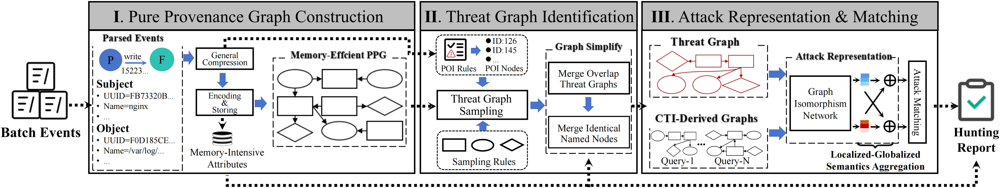
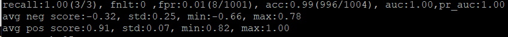

## 📋 Overview

This project is a core module of the ProHunter system, primarily designed to perform malicious judgment on threat graphs sampled from the [PPG module](https://github.com/xueboQiu/PPG). The main idea of this methods is that uses inexact graph vector matching to calculate vector similarity between threat graphs and attack query graphs generated from CTI, producing threat scores for judgment. The framework is illustrated as follows.



**Note:** This project serves as the downstream detection module of PPG, i.e., Attack Representation & Matching. For the complete workflow including provenance graph storage and threat graph sampling, please refer to the [PPG module](https://github.com/xueboQiu/PPG) first.

---

## 🚀 Quick Start

### Requirements

**Python Version:** 3.7.12

```bash
# Clone the repository
git clone https://github.com/xueboQiu/ProHunter
cd ProHunter

# Install dependencies
pip install -r requirements.txt
```


## 📊 Functional Modules

### 1️⃣ Threat Graph Visualization

Visualize threat graphs sampled by the PPG module.

**Usage:**

1. Place threat graph data in the corresponding dataset directory:
   ```
   dataset/darpa_cadets/sgs_demo/sce041214_E5A15412-68E0-FD54-A068-DD6114FD9040_2.txt # The case provided for visualization
   ```

2. Prepare mapping file (e.g., `names.json`), which could be automatically generated by running `dataset_preprocess.py` (see the workflow of **Threat Detection Module**)

3. Modify dataset paths in `subgraph_vision.py`, and run the visualization script:
   ```bash
   python subgraph_vision.py
   ```
   
   Specify the corresponding dataset in the script. The program will automatically read and visualize subgraph data from the `sgs_demo` directory.

**Example Visualization Result**:


---

### 2️⃣ Threat Detection Module

#### Step 1: Download Datasets

| Dataset              | Log Files                                  | Platform | Download Link                                                |
| -------------------- | ------------------------------------------ | -------- | ------------------------------------------------------------ |
| **E3-Cadets**        | ta1-cadets-e3-official-1.json.{0-4}        | FreeBSD  | [DARPA E3](https://github.com/darpa-i2o/Transparent-Computing/blob/master/README-E3.md) |
| **E3-Theia**         | ta1-theia-e3-official-6r.json.{0-12}       | Linux    | [DARPA E3](https://github.com/darpa-i2o/Transparent-Computing/blob/master/README-E3.md) |
| **E3-Trace**         | ta1-trace-e3-official.json.{0-203}         | Linux    | [DARPA E3](https://github.com/darpa-i2o/Transparent-Computing/blob/master/README-E3.md) |
| **E5-Theia**         | ta1-theia-1-e5-official-2.bin.{27-31}      | Linux    | [DARPA E5](https://github.com/darpa-i2o/Transparent-Computing) |
| **E5-Clearscope2_1** | ta1-clearscope-2-e5-official-1.bin.{15-20} | Android  | [DARPA E5](https://github.com/darpa-i2o/Transparent-Computing) |
| **E5-Clearscope2_2** | ta1-clearscope-2-e5-official-1.bin.{24-33} | Android  | [DARPA E5](https://github.com/darpa-i2o/Transparent-Computing) |
| **OPTC**             | benign/20-23Sep19/AIA-201-225/{*}          | Windows  | [OpTC](https://github.com/FiveDirections/OpTC-data)          |

Place downloaded files in the project directory following this structure:
```
datasets/darpa_{dataset_name}/raws/xx.json
```

#### Step 2: Data Preprocessing

```bash
python preprocess/dataset_preprocess.py  # Extract triple information from raw datasets:
```

This generates tuple files at:
```
datasets/darpa_{dataset_name}/tuples/xx.txt
```

#### Step 3: Build Training and Testing Datasets

```bash
python preprocess/parse_trace.py
```

#### Step 4: Model Training

```bash
python pretrain_gmpt_cl.py --mode={dataset_name} --eval=False
```


**Note:** Additional parameters (e.g., epoch, learning rate) can be found in the `parse_args()` function in `util.py`.

#### Step 5: Model Evaluation

```bash
python pretrain_gmpt_cl.py --mode={dataset_name} --eval=True
```

The model will load model parameters from `models/{dataset_name}/best.pth`.

### 3️⃣ Provided Example

The project provides pre-processed CADETS dataset samples for immediate testing:

```bash
# Direct evaluation (using pre-trained model)
python pretrain_gmpt_cl.py --mode=cadets --eval=True

# Re-train the model
python pretrain_gmpt_cl.py --mode=cadets --eval=False
python pretrain_gmpt_cl.py --mode=cadets --eval=True
```

**Example Evaluation Results :**



---

## 📁 Project Structure

```
ProHunter/
├── dataset/
│   └── darpa_cadets/              # Example dataset
│       ├── raws/                  # Raw dataset files
│       ├── sgs_demo/              
│       ├── test/                  
│       ├── train/                 
│       ├── tuples/                # Extracted tuples
│       ├── edge_type_map.json     
│       ├── names.json             # UUID to name mapping 
│       ├── node_type_map.json    
│       └── types.json             # UUID to type mapping
├── models/
│   └── {dataset_name}/
│       └── best.pth               # Trained model parameters
├── preprocess/                    # Data preprocessing scripts
├── subgraph/                      
├── batch.py                       
├── darpa_loader.py                # DARPA data loader
├── darpa_model.py                 
├── dataloader.py                  # Data loading utilities
├── graph_matching.py              
├── pretrain_gmpt_cl.py            # Main training & evaluation script
├── splitters.py                   
├── util.py                        # Utility functions & arguments
├── requirements.txt               # Dependencies
└── readme.md                      
```

